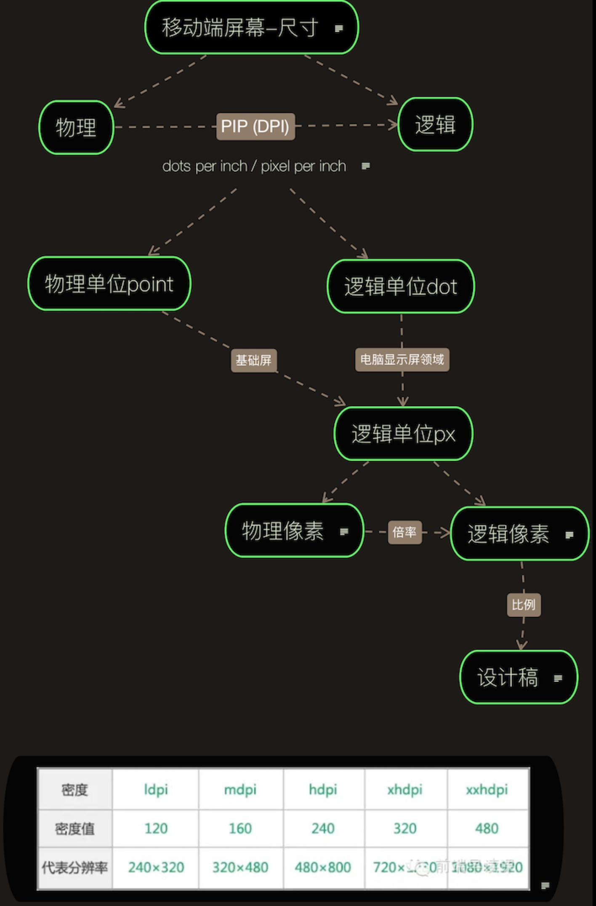

# 关于屏幕尺寸-物理像素／逻辑像素那点事儿

简单说明一下上图 其实没啥关系：

描述屏幕尺寸，通常从物理和逻辑两方面来，而DPI(dot per inch) 这个密度单位可以说是连接了物理和逻辑，表示每英寸的点数；

这个dot点，是个抽象的概念，在不同的领域具化起来有所不同，比如打印印刷领域通常是打印机输出的最小墨点，而电脑屏幕显示领域则是最小的像素点(就是滴一滴水在屏幕上就能看见的那种小格子)；PPI（pixel per inch）每英寸的像素点数，所以在讨论电脑屏幕显示时，dpi和ppi其实是一回事

ps：上面的dot是个抽象概念，但实际生活中常提到还有个point物理单位（点），这个是物理单位，1 in = 72pt，别混了。。。

再说回ppi,  pixel per inch 这里的pixel就是物理像素点，拿我的手机举个例子，分辨率为1440 * 2560 ，这个分辨率1440 * 2560 就表示屏幕上有1440 * 2560个物理像素点；

假如隔壁老王手机分辨率是1080 * 1920，然后设计师给了一个1080 * 1920的设计稿和一堆切图，假设这堆切图中有个图标大小是144px * 144px，那么怎么才能让视觉上我和老王看到的图标是一样大的呢？直接写死114px肯定不行，那样我手机上看到的图标肯定比老王小

这个时候就得说下,物理像素,逻辑像素和倍率了，看这里[`window.devicePixelRatio`](https://developer.mozilla.org/en-US/docs/Web/API/Window/devicePixelRatio)

我们从安卓客户端的角度来看，我和老王的手机都是安卓，屏幕密度分别是xxxhdpi和xxhdpi的，倍率分别是4，3；逻辑像素等于物理像素除以倍率，算下，其实二者的逻辑像素是一样的，都是360 * 640，可见这个逻辑像素比例才是决定最终显示效果的；刚刚说的那个尺寸为144px * 144px的图标，就是说这图标有144 * 144个物理像素点，那么其逻辑像素就是48 * 48

对于安卓和iOS，都有自己的逻辑像素单位，分别是dp和pt（这里的pt可不是前文提到的pt），那iOS和安卓er写个48pt/dp就差不多啦，接下来支持多种屏幕显示就是系统的事了，据说大概有三种方案（系统根据屏幕密度扩展修改逻辑像素单位的值，或者将可绘制资源扩展到适当大小比如缩放位图，或者针对不同屏幕密度提供不同尺寸的位图资源）

可是对于前端er呢。。很开心没有这个所谓的逻辑像素单位。

那我们就只能自己搞出适配的一套东西来。
比如这里只说下rem，rem单位是相对于`<html>`根元素的字体大小的。只要我们能根据不同屏幕大小设置不同的根元素字体大小，那么间接地就实现了不同屏幕采用不同的物理像素值，这时候这个rem就有点像别人家的dp/pt了。

